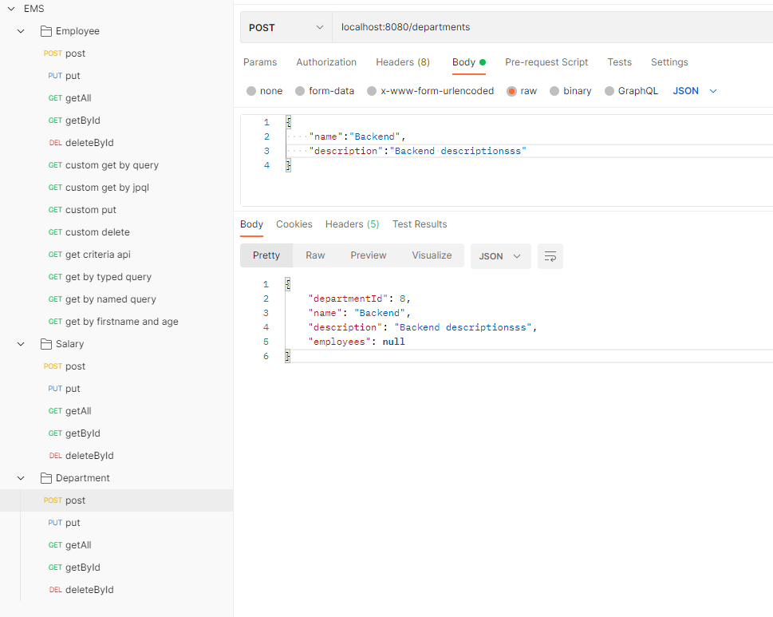

# internship-ems
This is employee management system.

# Employee

1. Post Employee

2. Put Employee

3. Get all Employee

4. Get Employee

5. Delete EMployee

# Salary

1. Post Salary

2. Put Salary

3. Get all Salary

4. Get Salary

5. Delete Salary

# Department

1. Post Department

2. Put  Department

3. Get all  Department

4. Get  Department

5. Delete  Department

